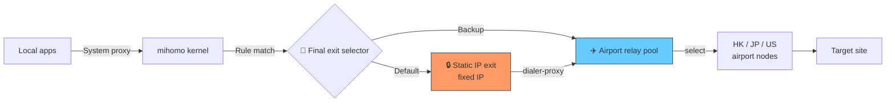

# clash-chain-proxy

> A Clash Verge / mihomo extension script that chains multiple proxy nodes together so that all traffic exits through a **fixed static IP**.

[简体中文](./README.md) · [Architecture](./docs/architecture.en.md)

## What is this?

A JavaScript extension script for the Clash Verge / mihomo kernel that automatically builds a **two-layer proxy chain**:

```
Apps → mihomo → Airport node (relay) → Static IP (exit) → Target site
```

All proxied traffic exits through the same static IP, so the destination always sees a consistent source address.

## Why a chained proxy?

Plain airport nodes have two problems:

1. **Volatile exit IP** — airport exit IPs rotate frequently, triggering account risk control or hitting API allow-list rejections
2. **Shared IP reputation** — many users share the same airport exit; the resulting IP reputation is poor and gets you stuck behind Cloudflare/Google captchas

The chain proxy solves this by:

- **Lower layer = airport** — keeps the speed and failover of regular airport nodes
- **Exit layer = static IP** — a stable overseas IP with clean reputation that never changes

## Features

- ✅ **Chained proxy** — uses `dialer-proxy` to compose multiple proxies into a single pipeline
- ✅ **Unified exit** — every proxied byte leaves through the same static IP
- ✅ **Domestic direct routing** — `GEOSITE,cn` automatically allows Chinese services to bypass the proxy
- ✅ **AI service targeting** — demonstrates how to make services like Microsoft Copilot work even though their parent domain is in `GEOSITE,cn`
- ✅ **Invalid node filter** — automatically removes airport "info nodes" with `0.0.0.0` server addresses
- ✅ **Crash defense** — falls back to the original config if the script throws, so Clash never becomes unusable

## Architecture



See the [architecture document](./docs/architecture.en.md) for the full breakdown.

## Quick start

### Prerequisites

- [Clash Verge Rev](https://github.com/clash-verge-rev/clash-verge-rev) installed (ships with the mihomo kernel)
- A working airport subscription
- A SOCKS5 / Shadowsocks-compatible static IP service (any provider whose IP doesn't rotate)

### Installation

1. **Grab the script**

   Download [`Script.js`](./Script.js).

2. **Replace the placeholders**

   Open `Script.js`, locate `staticProxyConfig` and fill in your details:

   ```javascript
   const staticProxyConfig = {
     name: "🔒 静态IP (出口)",
     type: "socks5",
     server: "YOUR_STATIC_IP_OR_DOMAIN",  // ← your static IP
     port: 443,
     username: "YOUR_USERNAME",            // ← your username
     password: "YOUR_PASSWORD",            // ← your password
     // ...
   };
   ```

3. **Wire it into Clash Verge**

   - Open Clash Verge → Profiles
   - On your airport subscription, click "Edit" → "Global Extension Script"
   - Paste the contents of `Script.js` and save
   - Click "Reload"

4. **Verify**

   - Open the Proxies page; you should see two new groups: `🚀 最终出口选择` and `✈️ 机场中转池`
   - Manually pick a stable relay node inside `✈️ 机场中转池`
   - Visit [https://ip.sb](https://ip.sb) — the displayed IP should match your static IP

## Making geo-blocked AI services work

Many AI services (e.g. Microsoft Copilot, parts of Google) share two traits:

- The parent domain (`bing.com`, `microsoft.com`) has Chinese operations and lives in `GEOSITE,cn`
- The AI feature itself uses **geo-IP detection**; requests from a Chinese IP receive a "region unavailable" response

A naive `DOMAIN-SUFFIX,bing.com,proxy` would route all of Bing through the proxy, which slows down domestic Bing search.

**The right approach**: use `DOMAIN` (exact match) to route only the AI-specific subdomains and login endpoints, placed *before* `GEOSITE,cn`. The script ships with a working Copilot example:

```javascript
`DOMAIN,copilot.microsoft.com,${groupFinalName}`,
`DOMAIN-SUFFIX,copilot.cloud.microsoft,${groupFinalName}`,
`DOMAIN,sydney.bing.com,${groupFinalName}`,
`DOMAIN,edgeservices.bing.com,${groupFinalName}`,
`DOMAIN,login.microsoftonline.com,${groupFinalName}`,
`DOMAIN,login.live.com,${groupFinalName}`,
```

Use the same pattern for Gemini, Notion AI, etc.

## Known limitations

| Limitation | Impact | Mitigation |
|---|---|---|
| No auto-fallback when the static IP goes down | Entire proxy chain breaks | Manually switch to `✈️ 机场中转池` direct mode |
| Relay pool is `select`, no auto load balancing | Need to manually rotate flaky nodes | You can switch to `url-test`, but the static IP tunnel will flap on every selection change |
| Plaintext credentials | File-system readers see them | Never commit your edited script to any repository |

## Repository layout

```
.
├── Script.js                       # Core script (sanitized template)
├── README.md                       # Chinese (primary)
├── README.en.md                    # English (this file)
├── LICENSE                         # MIT
├── docs/
│   ├── architecture.md             # Architecture deep dive (Chinese)
│   └── architecture.en.md          # Architecture deep dive (English)
└── examples/
    └── verge-profile-example.yaml  # Example airport profile
```

## Contributing

Issues and PRs welcome. If you use the same pattern to unblock other AI services, please contribute the rule snippets back.

## License

[MIT](./LICENSE)
