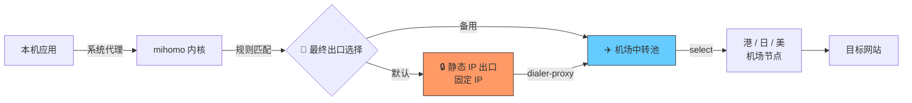

# clash-chain-proxy

> 基于 Clash Verge / mihomo 的链式代理脚本，将多个代理节点串联，最终从一个**固定出口 IP** 出网。

[English](./README.en.md) · [架构详解](./docs/architecture.md)

## 这是什么

一个 JavaScript 扩展脚本，运行在 Clash Verge / mihomo 内核中，自动构建一条**两层代理链**：

```
应用 → mihomo → 机场节点 (中转) → 静态 IP (出口) → 目标网站
```

所有需要代理的流量最终从同一个静态 IP 出去，目标网站看到的请求源始终一致。

## 为什么需要链式代理

普通机场节点存在两个问题：

1. **IP 不固定**：机场节点的出口 IP 经常变动，触发账号风控、被 API 白名单拒绝
2. **共享 IP 风险**：多人共用同一个机场出口，IP 信誉差，被 Cloudflare/Google 验证码骚扰

链式代理的解决方案：

- **底层走机场**：享受机场节点的速度和容灾能力
- **出口走静态 IP**：固定的境外 IP，干净的 IP 信誉，不会变动

## 核心特性

- ✅ **链式代理**：通过 `dialer-proxy` 把多个代理节点串成一条链路
- ✅ **统一出口**：所有代理流量从同一个静态 IP 出网
- ✅ **国内域名直连**：使用 `GEOSITE,cn` 自动放行国内服务
- ✅ **AI 服务定向代理**：示范了如何让 Microsoft Copilot 等"国内有运营但 AI 功能地理封锁"的服务正确走代理
- ✅ **无效节点过滤**：自动剔除机场返回的 `0.0.0.0` 信息节点
- ✅ **异常防御**：脚本崩溃时自动回退到原始配置，不会让整个 Clash 不可用

## 架构图



完整原理见 [架构文档](./docs/architecture.md)。

## 快速开始

### 前置条件

- 已安装 [Clash Verge Rev](https://github.com/clash-verge-rev/clash-verge-rev)（内置 mihomo 内核）
- 一份正常的机场订阅
- 一个支持 SOCKS5/Shadowsocks 的静态 IP 服务（IP 不变即可）

### 安装步骤

1. **复制脚本**

   下载 [`Script.js`](./Script.js) 到任意位置

2. **替换敏感信息**

   编辑 `Script.js`，找到 `staticProxyConfig`，替换占位符：

   ```javascript
   const staticProxyConfig = {
     name: "🔒 静态IP (出口)",
     type: "socks5",
     server: "YOUR_STATIC_IP_OR_DOMAIN",  // ← 改成你的静态 IP
     port: 443,
     username: "YOUR_USERNAME",            // ← 改成你的用户名
     password: "YOUR_PASSWORD",            // ← 改成你的密码
     // ...
   };
   ```

3. **接入 Clash Verge**

   - 打开 Clash Verge → 订阅页面
   - 在你的机场订阅上点「编辑」→「全局扩展脚本」
   - 粘贴 `Script.js` 内容并保存
   - 点击「重载配置」

4. **验证效果**

   - 进入 Proxies 页面，应该能看到 `🚀 最终出口选择` 和 `✈️ 机场中转池` 两个分组
   - 在 `✈️ 机场中转池` 中手动选一个稳定的中转节点
   - 访问 [https://ip.sb](https://ip.sb)，IP 应该显示为你的静态 IP

## 让 Microsoft Copilot 等地理封锁服务可用

很多 AI 服务（如 Microsoft Copilot、部分 Google 服务）的特点：

- 母域名（如 `bing.com`、`microsoft.com`）在中国有运营，被 GEOSITE,cn 数据库收录
- 但 AI 功能用**地理 IP 检测**，从中国 IP 访问会返回"区域不可用"

如果直接用 `DOMAIN-SUFFIX,bing.com,proxy` 会把整个 Bing 拉去代理，影响国内搜索。

**正确做法**：用 `DOMAIN`（精确匹配）只代理 AI 业务子域名 + 登录子域名，插在 `GEOSITE,cn` 之前。本脚本已内置 Copilot 的示范规则：

```javascript
`DOMAIN,copilot.microsoft.com,${groupFinalName}`,
`DOMAIN-SUFFIX,copilot.cloud.microsoft,${groupFinalName}`,
`DOMAIN,sydney.bing.com,${groupFinalName}`,
`DOMAIN,edgeservices.bing.com,${groupFinalName}`,
`DOMAIN,login.microsoftonline.com,${groupFinalName}`,
`DOMAIN,login.live.com,${groupFinalName}`,
```

按相同模式可以加入其他服务（Gemini、Notion AI 等）。

## 已知限制

| 限制 | 影响 | 缓解方案 |
|---|---|---|
| 静态 IP 宕机无自动 fallback | 整个代理链失效 | 手动切换到 `✈️ 机场中转池` 直出 |
| 中转池 select 类型无自动选优 | 节点抖动需手动换 | 可改为 `url-test`，但会引起静态 IP 隧道闪断 |
| 凭据明文存储 | 文件可读权限暴露 | 不要把改好的脚本提交到任何仓库 |

## 文件结构

```
.
├── Script.js                       # 核心脚本（脱敏模板）
├── README.md                       # 中文说明（本文件）
├── README.en.md                    # 英文说明
├── LICENSE                         # MIT
├── docs/
│   ├── architecture.md             # 架构详解（中文）
│   └── architecture.en.md          # 架构详解（英文）
└── examples/
    └── verge-profile-example.yaml  # 示例订阅配置
```

## 贡献

欢迎 issue 与 PR。如果你用相同的模式解决了其他 AI 服务的访问问题，欢迎把规则贡献回来。

## License

[MIT](./LICENSE)
