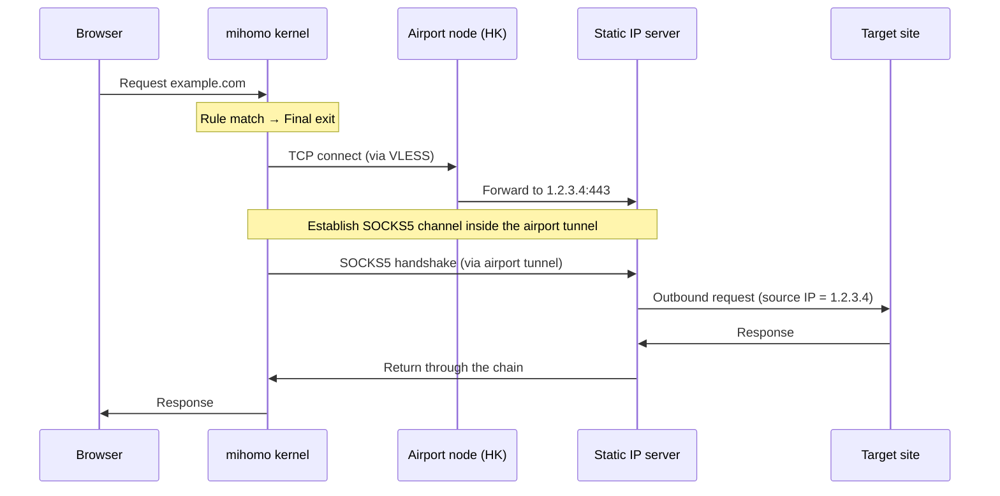

# Architecture Deep Dive

[简体中文](./architecture.md) · [Back to README](../README.en.md)

## 1. Motivation

Pain points of vanilla airport proxies:

| Problem | Symptom |
|---|---|
| Volatile exit IP | Account risk control, "login from new location" alerts, constant Cloudflare challenges |
| Poor IP reputation | API outright refuses, Google search forces captcha endlessly |
| Shared with other users | TikTok / YouTube detect proxy traffic and throttle |

Goal: **all proxied traffic should leave through one fixed, clean overseas IP**.

The simplest solution is to buy an overseas VPS and use it as a proxy, but VPSes are typically low-bandwidth, high-latency, and require self-maintenance. Chained proxying combines the best of both:

- **Airport node**: high-throughput transport (low latency, large bandwidth)
- **Static IP node**: clean exit (fixed IP, good reputation)

## 2. How chained proxying works

### 2.1 The dialer-proxy mechanism

Key feature of the mihomo kernel: every proxy node can specify a `dialer-proxy` field that routes the underlying TCP/UDP connection through another proxy.

```yaml
- name: "🔒 Static IP (exit)"
  type: socks5
  server: 1.2.3.4
  port: 443
  dialer-proxy: "✈️ Airport relay pool"   # Key: when connecting to the static IP server, go via the airport pool
```

Without `dialer-proxy`, mihomo would dial `1.2.3.4:443` directly. With it set:

1. mihomo first picks an airport node (e.g. a Hong Kong VLESS node)
2. It establishes a tunnel to `1.2.3.4:443` through the Hong Kong node
3. SOCKS5 protocol runs inside that tunnel, and the request finally exits from `1.2.3.4`

### 2.2 Full traffic path



The destination always sees the source IP `1.2.3.4`, regardless of which airport node is currently in use.

### 2.3 Why not connect directly to the static IP?

Without going through an airport, mihomo dialing `1.2.3.4:443` directly would suffer:

1. **High cross-border latency** — direct connections from China to overseas SOCKS5 servers easily exceed 200ms
2. **Limited bandwidth** — overseas VPS direct links to China are usually capped low
3. **Likely blocked** — direct SOCKS5/Shadowsocks connections to overseas IPs are easily fingerprinted by the GFW

Going via an airport node gives you:
- BGP-optimized routing → just tens of ms to HK/JP
- Bandwidth scales with the airport's capacity
- Already-obfuscated protocols that survive GFW detection

## 3. Script.js module breakdown

The script has 5 modules, executed in order:

### Module 1: Core configuration

Defines the static IP node and the group name constants. All user-editable fields live here.

### Module 2: Optimized rule set

Builds the `optimizedDirectRules` array containing:

| Category | Rules | Purpose |
|---|---|---|
| LAN | `GEOSITE,private` + IP-CIDR | Direct intranet traffic |
| Ad block | `GEOSITE,category-ads-all,REJECT` | Block ads |
| P2P processes | `PROCESS-NAME,*` | Direct route for download tools so they don't slow down the proxy |
| **AI service targeting** | `DOMAIN,copilot.microsoft.com,...` | **Critical: must come *before* `GEOSITE,cn`** |
| Domestic domains | `GEOSITE,cn,DIRECT` | Bulk allow Chinese services |
| Domestic IPs | `GEOIP,CN,DIRECT` | Final fallback |

**Why the order matters**: mihomo evaluates rules top-to-bottom and stops at the first match. If `DOMAIN,copilot.microsoft.com` comes after `GEOSITE,cn`, it never fires — `microsoft.com` lives in the `cn` GEOSITE database, so it would already have been routed `DIRECT`.

### Module 3: Node extraction

Pulls every valid proxy node from `config.proxies`. Filter conditions:

```javascript
p &&                                  // The node object exists
p.type &&                             // Has a type field
p.server &&                           // Has a server field
p.server !== "0.0.0.0" &&             // Exclude info-only nodes
p.server !== "127.0.0.1" &&           // Exclude loopback
validNodeTypes.includes(p.type) &&    // Type is a known protocol
p.name !== staticProxyConfig.name     // Exclude the static IP itself to avoid recursion
```

The last check is crucial: **without excluding the static IP itself**, the airport pool would include the static IP node, whose `dialer-proxy` points back at the airport pool — an infinite loop.

### Module 4: Group construction

```javascript
config["proxy-groups"] = [
  { name: groupFinalName, type: "select", proxies: [staticProxyConfig.name, groupAirportName] },
  { name: groupAirportName, type: "select", proxies: airportProxies }
];
```

Two groups:

- **🚀 Final exit selector**: the user-facing master switch. Default: static IP (chained proxy). Can be flipped to "airport pool only" as a backup.
- **✈️ Airport relay pool**: the underlying transport for the static IP. `select` type — once chosen, it stays put.

### Module 5: Rule merging

Merges the optimized ruleset with the subscription's original rules:

```javascript
const finalRules = [...optimizedDirectRules];

config.rules.forEach((rule) => {
  const policy = parseRulePolicy(rule);

  if (policy === "DIRECT" || policy.startsWith("REJECT")) {
    finalRules.push(rule);  // Keep as-is
  } else {
    finalRules.push(rewriteToFinalGroup(rule));  // Rewrite to the final exit
  }
});

finalRules.push(`MATCH,${groupFinalName}`);  // Catch-all
```

Design philosophy: **the subscription's DIRECT and REJECT rules reflect the airport maintainer's judgement about which Chinese services should bypass the proxy — keep them. Every other "go through proxy" rule is rewritten to the final exit so our chain takes over.**

## 4. Key design decisions

### 4.1 Why `select` instead of `url-test`?

Chained proxying lives or dies by **the stability of the underlying TCP connection**. `url-test` rotates to the fastest node every few minutes, and every rotation:

- Forces the static IP dialer to re-establish its connection
- Drops every existing long-lived connection (WebSocket, SSH, video stream)
- Triggers a fresh TLS handshake in the browser

`select` stays put once chosen and the chain remains stable. The trade-off is losing automatic optimization — you have to swap nodes manually if one gets flaky.

### 4.2 Why `udp-over-tcp: true`?

In a chained proxy, UDP packets have to be relayed through several layers of tunneling. Many airport nodes have incomplete UDP forwarding support, leading to packet loss or jitter.

`udp-over-tcp: true` shoves the SOCKS5 UDP traffic into a TCP tunnel — sacrificing some performance for stability. Bad for games and voice, but for browsing and AI chat the impact is negligible.

### 4.3 Why the try-catch defense?

Subscription YAML occasionally contains unexpected structures (a node missing a field, etc.). If the script throws, the entire Clash Verge config reload fails, and **the user discovers they have no network at all**.

With try-catch wrapping the script, exceptions return the original config. At least the airport nodes still work — far better than "totally broken".

## 5. Extension points

### 5.1 Adding more AI services

The pattern: find the service's core subdomain(s) and login subdomain(s), then insert `DOMAIN` (exact match) rules **before** `GEOSITE,cn`.

Example for Google Gemini:
```javascript
`DOMAIN,gemini.google.com,${groupFinalName}`,
`DOMAIN,bard.google.com,${groupFinalName}`,
```
(Google is not in `GEOSITE,cn`, so technically you don't need to add this — but doing so guarantees correct routing even if the GEOSITE database changes.)

### 5.2 Switching to `fallback` for auto failover

Change `🚀 Final exit selector` to `fallback`:

```javascript
{
  name: groupFinalName,
  type: "fallback",
  url: "http://www.gstatic.com/generate_204",
  interval: 60,
  proxies: [staticProxyConfig.name, groupAirportName]
}
```

Behavior: mihomo probes the static IP every 60 seconds and automatically falls back to airport-direct if it goes down. Cost: every switch causes a brief connection flap.

### 5.3 Load balancing across multiple static IPs

If you have several static IPs:

```javascript
const staticProxies = [
  { name: "🔒 Static-A", server: "1.1.1.1", ... },
  { name: "🔒 Static-B", server: "2.2.2.2", ... },
];
staticProxies.forEach(p => p["dialer-proxy"] = groupAirportName);
config.proxies.push(...staticProxies);

config["proxy-groups"].push({
  name: "🔒 Static IP pool",
  type: "load-balance",
  strategy: "consistent-hashing",  // Same target → same exit, avoids session jumps
  proxies: staticProxies.map(p => p.name)
});
```

Note the `consistent-hashing` strategy: the same target domain always goes through the same static IP, preventing accounts from being flagged as "hopping between IPs".
