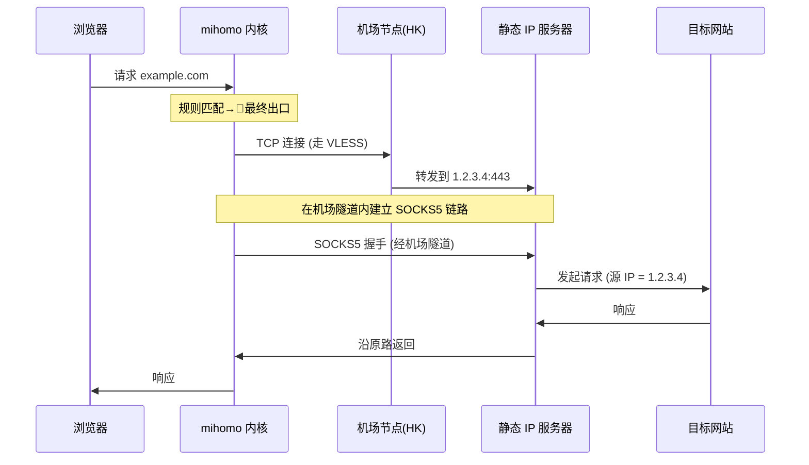

# 架构详解

[English](./architecture.en.md) · [返回首页](../README.md)

## 1. 设计动机

普通机场代理的痛点：

| 问题 | 表现 |
|---|---|
| 出口 IP 频繁变动 | 账号风控、被异地登录提醒、Cloudflare 频繁验证 |
| IP 信誉差 | API 直接拒绝、Google 搜索一直要选红绿灯 |
| 多人共享 | 抖音/YouTube 检测到代理后限速 |

需求：**所有需要代理的流量从一个固定的、干净的境外 IP 出去**。

最简单的方案是直接买一个境外 VPS 当代理，但 VPS 通常带宽小、延迟高、且需要自己维护。链式代理把两者结合：

- **机场节点**：负责高速传输（低延迟、大带宽）
- **静态 IP 节点**：负责出口（IP 固定、信誉好）

## 2. 链式代理的工作原理

### 2.1 dialer-proxy 机制

mihomo 内核的关键特性：每个代理节点可以指定 `dialer-proxy` 字段，让该节点的**底层 TCP/UDP 连接**走另一个代理。

```yaml
# 静态 IP 节点
- name: "🔒 静态IP (出口)"
  type: socks5
  server: 1.2.3.4
  port: 443
  dialer-proxy: "✈️ 机场中转池"   # 关键: 连接静态 IP 服务器时, 走机场池
```

正常情况下 mihomo 会直连 `1.2.3.4:443`。设置 `dialer-proxy` 后：
1. mihomo 先选一个机场节点（比如香港节点）
2. 通过香港节点建立到 `1.2.3.4:443` 的隧道
3. 在这个隧道里跑 SOCKS5 协议，最终从 `1.2.3.4` 出网

### 2.2 完整流量路径



目标网站看到的源 IP 永远是 `1.2.3.4`，无论本地连的是哪个机场节点。

### 2.3 为什么不直接连静态 IP

如果不走机场，mihomo 直连 `1.2.3.4:443` 会遇到：

1. **跨境延迟高**：从中国直连境外 SOCKS5 服务器延迟 200ms+
2. **带宽受限**：境外 VPS 直连中国带宽通常很小
3. **可能被封锁**：直连境外的 SOCKS5/Shadowsocks 容易被 GFW 识别

走机场的好处：
- 机场节点的 BGP 优化路由，到香港/日本只有几十毫秒
- 机场带宽通常按需扩容，速度有保障
- 机场节点已经做好了协议混淆，不会被 GFW 拦截

## 3. Script.js 模块拆解

脚本分为 5 个模块，按执行顺序：

### 模块 1：核心配置

定义静态 IP 节点和分组名常量。这里集中所有需要修改的配置。

### 模块 2：规则集构建

构建一个 `optimizedDirectRules` 数组，包含：

| 类别 | 规则 | 作用 |
|---|---|---|
| 局域网 | `GEOSITE,private` + IP-CIDR | 内网流量直连 |
| 广告拦截 | `GEOSITE,category-ads-all,REJECT` | 拦截广告 |
| P2P 进程 | `PROCESS-NAME,*` | 下载工具直连，避免拖慢代理 |
| **AI 服务定向代理** | `DOMAIN,copilot.microsoft.com,...` | **关键：必须在 GEOSITE,cn 之前** |
| 国内域名 | `GEOSITE,cn,DIRECT` | 一刀切放行国内服务 |
| 国内 IP | `GEOIP,CN,DIRECT` | 兜底 |

**规则顺序的重要性**：mihomo 按顺序匹配规则，命中即停止。如果把 `DOMAIN,copilot.microsoft.com` 写在 `GEOSITE,cn` 之后，永远不会被命中（因为 `microsoft.com` 在 `cn` 数据库中，会被先匹配走 DIRECT）。

### 模块 3：节点提取

从订阅源 `config.proxies` 中提取所有有效代理节点，过滤条件：

```javascript
p &&                                  // 节点对象存在
p.type &&                             // 有 type 字段
p.server &&                           // 有 server 字段
p.server !== "0.0.0.0" &&             // 排除信息节点
p.server !== "127.0.0.1" &&           // 排除回环
validNodeTypes.includes(p.type) &&    // 类型是已知协议
p.name !== staticProxyConfig.name     // 排除静态 IP 自身, 防止循环引用
```

最后一步关键：**如果不排除静态 IP 自身**，机场池会包含静态 IP 节点，而静态 IP 的 dialer-proxy 又指向机场池——形成无限递归循环。

### 模块 4：分组构建

```javascript
config["proxy-groups"] = [
  { name: groupFinalName, type: "select", proxies: [staticProxyConfig.name, groupAirportName] },
  { name: groupAirportName, type: "select", proxies: airportProxies }
];
```

两个分组：

- **🚀 最终出口选择**：用户可见的总开关。默认走静态 IP（链式代理），可手动切换到机场池直出
- **✈️ 机场中转池**：静态 IP 的底层传输通道。`select` 类型，手动选定后稳定不变

### 模块 5：规则合并

合并优化规则集和订阅源原始规则：

```javascript
const finalRules = [...optimizedDirectRules];

config.rules.forEach((rule) => {
  // 解析规则的策略部分
  const policy = parseRulePolicy(rule);

  if (policy === "DIRECT" || policy.startsWith("REJECT")) {
    finalRules.push(rule);  // 保留原样
  } else {
    finalRules.push(rewriteToFinalGroup(rule));  // 重写到最终出口
  }
});

finalRules.push(`MATCH,${groupFinalName}`);  // 兜底
```

设计理念：**订阅源的 DIRECT 和 REJECT 规则反映的是机场维护者对国内服务的判断，保留这些规则。其他所有"走代理"的规则统一重写到最终出口，由我们的链式代理接管。**

## 4. 关键设计决策

### 4.1 为什么用 select 而不是 url-test

链式代理的特点是**底层 TCP 连接的稳定性至关重要**。url-test 每隔几分钟切换最快节点，每次切换都会导致：

- 静态 IP 的 dialer 重新建立连接
- 已有的长连接（WebSocket、SSH、视频流）全部断开
- 浏览器需要重新握手 TLS

select 类型一旦选定就不变，链路稳定。代价是失去自动选优，需要手动切换节点。

### 4.2 为什么 udp-over-tcp 设为 true

链式代理下，UDP 包要在多层隧道中转发。许多机场节点的 UDP 转发支持不完整，会出现丢包或延迟抖动。

`udp-over-tcp: true` 让 SOCKS5 的 UDP 流量通过 TCP 隧道传输，牺牲一点性能换稳定性。对游戏、语音不友好，但对一般浏览/AI 对话影响很小。

### 4.3 为什么有 try-catch 防御

订阅源的 yaml 偶尔会出现非预期结构（比如某个节点缺字段），脚本一旦抛异常，整个 Clash Verge 配置加载失败，**用户会发现连不上任何网络**。

try-catch 包裹后，异常时返回原始 config，至少保证机场节点能正常用，比"完全不可用"好得多。

## 5. 可扩展点

### 5.1 添加更多 AI 服务

模式：找出该服务的核心子域名 + 登录子域名，用 `DOMAIN`（精确）插在 `GEOSITE,cn` 之前。

例如 Google Gemini：
```javascript
`DOMAIN,gemini.google.com,${groupFinalName}`,
`DOMAIN,bard.google.com,${groupFinalName}`,
```
（Google 不在 GEOSITE,cn 中，理论上不必专门加，但加上可以确保即使 Google 域名规则改变也能正确路由）

### 5.2 改用 fallback 类型实现自动容灾

将 `🚀 最终出口选择` 改为 `fallback` 类型：

```javascript
{
  name: groupFinalName,
  type: "fallback",
  url: "http://www.gstatic.com/generate_204",
  interval: 60,
  proxies: [staticProxyConfig.name, groupAirportName]
}
```

效果：mihomo 每 60 秒探测静态 IP 健康状态，一旦不通自动切换到机场池直出。代价：每次切换会闪断一次连接。

### 5.3 多静态 IP 负载均衡

如果有多个静态 IP，可以：

```javascript
const staticProxies = [
  { name: "🔒 静态IP-A", server: "1.1.1.1", ... },
  { name: "🔒 静态IP-B", server: "2.2.2.2", ... },
];
staticProxies.forEach(p => p["dialer-proxy"] = groupAirportName);
config.proxies.push(...staticProxies);

config["proxy-groups"].push({
  name: "🔒 静态IP池",
  type: "load-balance",
  strategy: "consistent-hashing",  // 同一目标走同一出口, 避免会话切换
  proxies: staticProxies.map(p => p.name)
});
```

注意 `consistent-hashing` 策略：同一个目标域名永远走同一个静态 IP，避免账号被识别为"在多个 IP 之间跳跃"。
